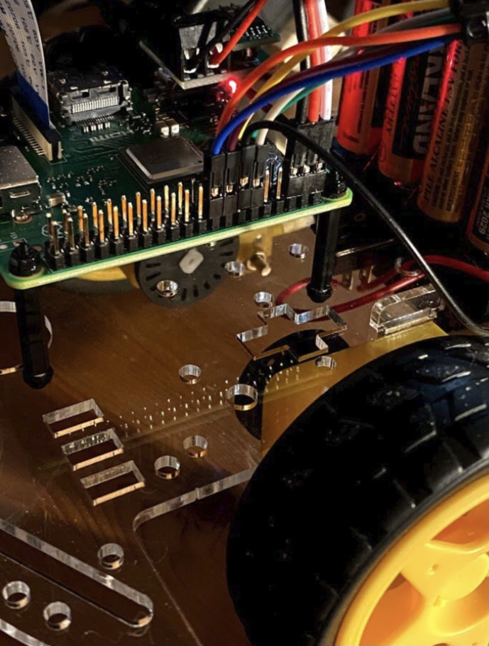
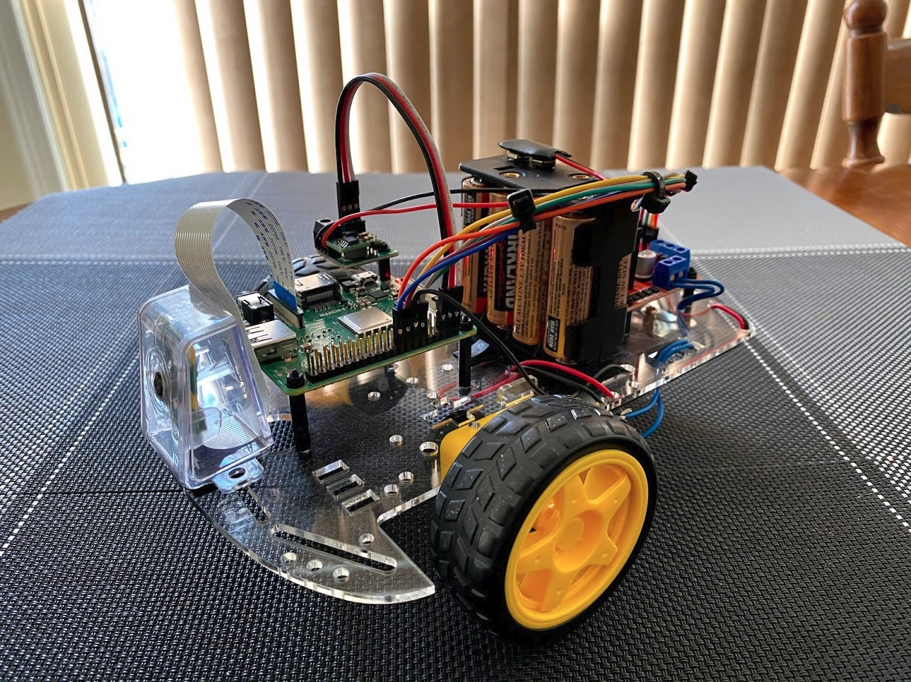
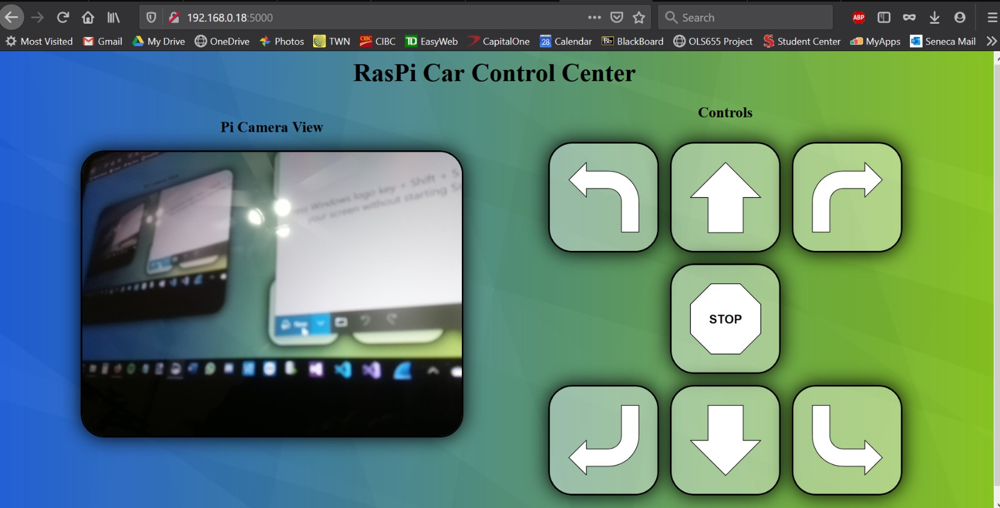

# Web-Controlled-RC-Car

The website displays a live camera feed along with buttons to control the movement of the car

*This project was worked on during the 2020 winter semester for the course TPJ-655: Final Project.*

## Developers
- Mark Brierley
- [Matthew Percy](https://percy.tech)

## Screenshots
### RC car

### Web view

